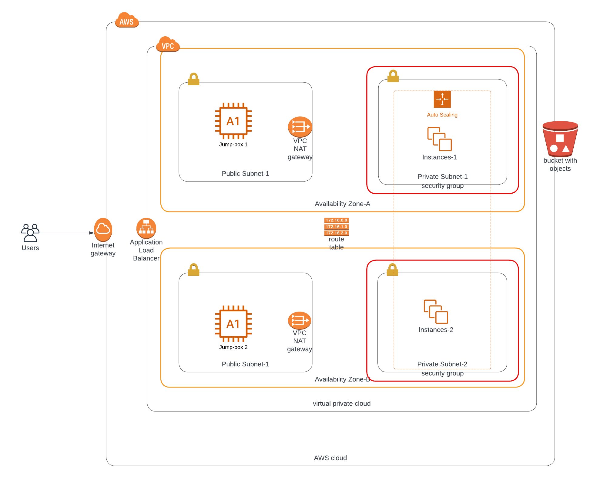

### Udagram/Udacity - Deploy a high-availability web app using CloudFormation
This application deploy apache web-server on aws ec2 instance using cloudformation script.

## Link to Loadbalancer [LBDSNname](http://udagr-webap-gxuge5y99dzg-911395205.us-east-1.elb.amazonaws.com/)
'Note:' this linnk won't be avalaible after feedback from tutor verify assignment


### Resources and Description
1. VPC - Virtual Private Cloud for all the resources which shared connection under CIDR
2. InternetGateway - Creating connection from outside word to the servers at port :80
3. subnets [2Publics & 2Privates] - creating Sub Cidr with extra protection
4. Availability Zones - Creating resources for multiple region for high availability and high availability
5. NAT Gateway - NAT Gateway provide communication from the private subnets with the public subnets
6. Instances [2each for each AZ] - This Instance is install on the Private subnets and run apache
7. LoadBalancer - This is connected to Internet Gateway which provide request balance to all resources and check Heathy of resources
8. AutoScaling - Increasing and decrease instance base on instance state and request demands
9. RouteTable - This bring about communication between resourses in vpc - security layer 
10. S3 buckets - store simple webpage (index.htm) that 
11. IAM role - intance role to have access to s3 buckets

## Infrastructure as Code - Supporting Material and Starter Code
This folder provides the supporting material and starter code for the "ND9991 - C2- Infrastructure as Code" course. This folder contains the following folders:
1. project_starter - It contains the starter code.
2. project_starter/README.md - AWS cloudformation  commands to run.
3. create.sh - The file contain aws cloudformation cammand for creating stack
4. create.sh - The file contain aws cloudformation cammand for updating stack
5. images/udagram - Luci Diagram for udagram


### Dependencies
##### 1. AWS account
You would require to have an AWS account to be able to build cloud infrastructure.

##### 2. VS code editor
An editor would be helpful to visualize the image as well as code. Download the VS Code editor [here](https://code.visualstudio.com/download).

##### 3. An account on www.lucidchart.com
A free user-account on [www.lucidchart.com](www.lucidchart.com) is required to be able to draw the web app architecture diagrams for AWS.


### How to run the supporting material?
You can run the supporting material in two easy steps:
```bash
# Ensure that the AWS CLI is configured before runniing the command below
# Create the network infrastructure
# Check the region in the create.sh file
./create.sh <stack_name> <file-dirname.yml> <file-dirname-to-parameters.json>
# Create servers
# Change the AMI ID and key-pair name in the servers.yml
# Check the region in the update.sh file
./update.sh <stack_name> <file-dirname.yml> <file-dirname-to-parameters.json>
```


### Sample Commands for creating aws cloudformation is found [here](./project_starter/README.md) 